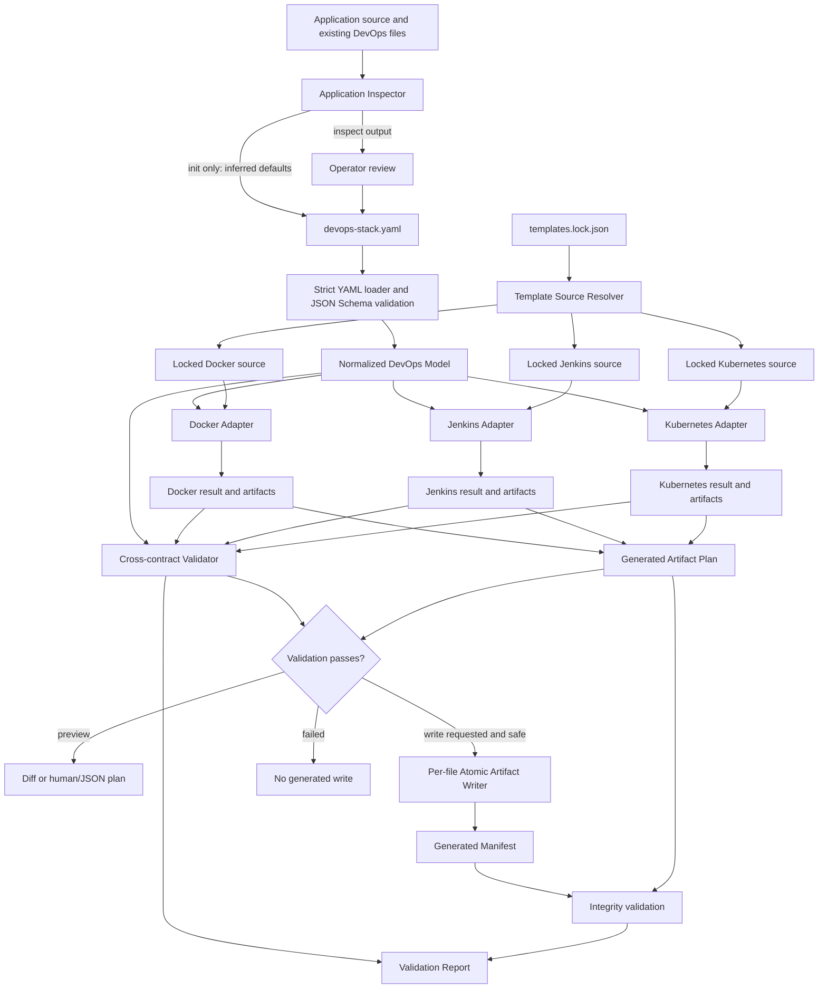
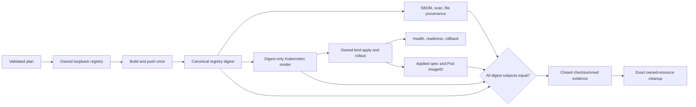

# Architecture

DevOps Stack Composer has one configuration model, three adapter projections, and two
separate product paths. Static composition has contract validation before a write and
manifest integrity after a write. Opt-in execution consumes the same validated model
but adds resource ownership, immutable artifact identity, runtime observation, and a
closed evidence boundary.

## Runtime flow

Inspection is advisory. It is used by `inspect`, by `init` to seed a file marked for
review, and as report context. Normal composition never lets detection override a
declared configuration value.

## Components

| Component | Responsibility |
| --- | --- |
| `inspector.py` | Conservatively detects supported runtimes, commands, ports, probes, and existing DevOps files. |
| `config.py` and the JSON Schema | Parse YAML, reject unknown or malformed fields, normalize validation errors, and hash canonical input. |
| `model.py` | Deep-merge environment overrides and create the immutable cross-project model. |
| `locks.py` and `sources.py` | Validate template metadata, resolve local/cache/remote sources, and verify Git commits and required markers. |
| `adapters/` | Project the normalized model into deterministic files and invoke official upstream validation seams in isolation. |
| `validation.py` | Compare declared adapter contracts, inspect primary artifact bytes, and enforce semantic and production policies. |
| `manifest.py` and `filesystem.py` | Plan ownership-aware writes, enforce path containment, write atomically, and verify content hashes and modes. |
| `diffing.py` and `explain.py` | Show planned changes and trace generated-file or configuration provenance. |
| `doctor.py` and `report.py` | Diagnose the host and write redacted operator/machine reports. |
| `execution.py` and `execution_state.py` | Plan cumulative profiles, enforce state transitions, orchestrate one build and runtime, and close success or failure evidence. |
| `process_runner.py` | Run allowlisted argument vectors with contained working directories, reduced environments, deadlines, cancellation, bounded output, and redaction. |
| `registry.py`, `kind_cluster.py`, and `resource_recovery.py` | Create, seal, inspect, recover, and remove only exact run-owned local resources. |
| `build_once.py`, `supply_chain.py`, and `kubernetes_execution.py` | Resolve the pushed digest, bind SBOM/scan/provenance to it, deploy it, probe it, and observe the runtime digest. |
| `evidence_store.py`, `execution_bundle.py`, and `release_assets.py` | Write project-contained evidence, close its inventory, verify it offline, and assemble safe release files. |
| `release_validation.py` | Compare local and freshly downloaded release bytes, verify GitHub attestations, and enforce clean tag/commit gates. |

## Normalized contract

The YAML loader validates the complete input before `normalize_config` runs. Base
deployment values are deep-merged with each environment override in the fixed order
`dev`, `staging`, `production`. The model supplies all adapters with the same image,
port, probe, security, environment, and routing facts. Dynamic tag strategies are
represented during generation by `__IMAGE_TAG__` plus a Jenkins-time expression;
Jenkins must resolve a concrete tag before any load, push, or deployment.

Each adapter returns an immutable `AdapterResult` containing its name and version,
the resolved template commit, generated artifacts, a canonical contract, and typed
diagnostics. The validator checks both the returned contract and values recovered
from primary generated files. This prevents a matching declaration from hiding drift
in rendered output.

## Template boundary

Template repositories are not copied into this repository. Resolution is driven by
the lock file, and validation occurs in temporary staging directories. Official
Docker shell scripts, Jenkins PowerShell plan/export scripts, and Kubernetes
PowerShell query/render/validation scripts remain the executable authorities at the
template boundary. Source repositories are not written by composition.

Details of resolution order and the interfaces used are in
[`TEMPLATE_INTEGRATION.md`](TEMPLATE_INTEGRATION.md).

## Write and integrity boundary

All persistent paths are normalized relative paths under the selected project root.
The writer rejects traversal and symlink escapes, writes through a temporary file plus
`os.replace`, and records SHA-256 and POSIX mode for every owned artifact.

On a later run, a file can be created, unchanged, replaced, or reported as a
conflict. Previously owned paths that are no longer planned are `stale` and require
manual deletion. Other content in `generated/` is `unowned` and always blocks a
write. Integrity validation also compares the current config hash, template/adapter
versions, on-disk bytes and modes, and freshly rendered content with the manifest.

## Deployment-time boundary

The generated Jenkins pipeline owns delivery sequencing, not Jenkins controller
configuration. JCasC, plugins, agents, authorization, seed-job wiring, and credential
values remain external. During deployment the pipeline copies a Kubernetes overlay
to a temporary directory, replaces the placeholder image with its concrete immutable
tag, renders it with Kustomize, applies it, waits for rollout, and only attempts
rollback when apply actually started a Deployment rollout.

## Execution-time boundary

The registry endpoint and mutable tag are runtime coordinates, not artifact
identity. `BuildResult.manifest_digest` is the canonical subject. Every later model
accepts the immutable `repository@sha256:...` reference and rejects a fallback to a
tag. Runtime attestation compares independently parsed rendered YAML, Kubernetes API
workload state, and Pod `imageID` values with that subject.

The state journal is written incrementally so an interrupted process leaves a usable
run identity and recovery record. Canonical evidence is closed only after required
stages and cleanup have definite outcomes. The verifier recalculates content rather
than trusting the journal's declarations.

## Release-time boundary

A closed release set embeds one successful kind evidence bundle and exact package
bytes. Local verification is intentionally offline. Publication then adds GitHub
artifact attestations; the post-publication profile downloads fresh bytes and
requires repository, signer workflow, tag ref, and source commit identity before the
release stages can pass. File provenance in the portable set remains marked
`cryptographicallyVerified: false`; the separate GitHub attestation result is
reported independently.
